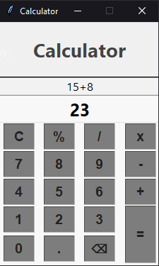

# Python Calculator

Calculator with graphical interface

## Features
- `Calculator:` 
Addition, subtraction, division, multiplication and percentage.

<br>
<div display: inline_block align="center">
    
</div>

## :file_folder: Accessing the project
You can use the [executable](https://github.com/DiogoCosta2449/Calculadora-Simples/blob/dev-calculadora/dist/Calculator.exe) or the [Python file](https://github.com/DiogoCosta2449/Calculadora-Simples/blob/dev-calculadora/Calculator.py).
```bash
python Calculator.py
```
or
```bash
Open Calculator.exe
```
## Requirements
* Python >= Python 3.x

## Used libraries
* `Tkinter`
